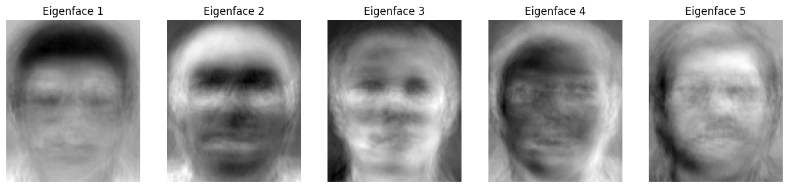

# **Face Recognition**

### **Generating the Data Matrix and the Label vector**
___
- #### The Data Matrix is 400 x 10304 where each image is flattened in a vector and saved as a row in the Matrix
- #### Each 10 images of a person are given the same label from [1:40]
```python
paths = ["datasets/s" + str(i) for i in range(1, 41)]
cnt = 0
Data = np.zeros((400, 10304))
labels = np.zeros((400, 1))
for i in range(40):
    labels[i * 10 : (i + 1) * 10] = i + 1
for path in paths:
    files = os.listdir(path)
    for file in files:
        img = Image.open(path + "/" + file)
        np_img = np.array(img)
        np_img = np_img.flatten()
        Data[cnt] = np_img
        cnt += 1
```
### **Spliting the Dataset into Training and Test sets**
___
- #### Keeping the odd rows (assuming row[0] is the odd) for Training and the even rows (assuming row[1] is even) for Testing
```python
X_train = Data[0::2]
X_test = Data[1::2]
y_train = labels[0::2]
y_test = labels[1::2]
```
### **Classification using PCA**
___
- #### **Trick in getting eigen values/vectors from Cov Matrix**
1. ##### The Cov Matrix is Computed as Z.T * Z (10304 x 10304) so getting the eigen values/vectors from this matrix requires too much time.
2. ##### So instead we computed Cov matrix as Z * Z.T, According to Linear Algebra the eigen values computed from this matrix is the same as the original one but takes only the first 200 (which covers over 99% of the total variance).
3. ##### Where the original eigen vectors are restored by this formula: ui=A*vi where ui is the original eigen vector (10304 x 1) and vi is the smaller one (200 x 1).
4. ##### It gives the same results and in lesser time. 
- #### pseudo code for PCA
```python
def get_PCA(X_train, alpha):
    # Compute the mean of the training data
    mean_face = np.mean(X_train, axis=0)
    # subtract the mean from the training data
    X_train_centralized = X_train - mean_face
    # compute the covariance matrix
    cov_matrix = X_train_centralized @ X_train_centralized.T
    # compute the eigenvalues and eigenvectors
    eigenvalues, eigenvectors = np.linalg.eig(cov_matrix)
    # sort the eigenvectors descindigly by eigenvalues
    idx = np.argsort(eigenvalues)[::-1]
    eigenvalues = eigenvalues[idx]
    eigenvectors = eigenvectors[:, idx]
    # restore the original eigenvectors
    eigenvectors_converted = X_train_centralized.T @ eigenvectors
    # normalize the eigenvectors_converted
    eigenfaces = eigenvectors_converted / np.linalg.norm(eigenvectors_converted, axis=0)
    # compute the number of components to keep
    sum = 0
    no_components = 0
    for i in range(len(eigenvalues)):
        sum += eigenvalues[i]
        no_components += 1
        if sum / np.sum(eigenvalues) >= alpha:
            break
    # project the training data on the eigenfaces
    return  mean_face, eigenfaces[:, :no_components]
```
### The first 5 eigen faces (zombies)
---

### Projecting The Train Data and Test Data using the Same Projection Matrix
___
```python
def PCA_Projection(mean_face,eigenfaces):
    X_train_centered = X_train - mean_face
    X_train_projected = X_train_centered @ eigenfaces
    X_test_centered = X_test - mean_face
    X_test_projected = X_test_centered @ eigenfaces
    return X_train_projected, X_test_projected
```
### Using KNN with K=1 as a classifier
___
- #### The Classifier is trained with the projected training data using **knn.fit()**
- #### Then the classifier is given the projected test data and the predicted values (labels) are saved in **Y_pred**
- #### The y_pred is compared with the y_test (actual labels)
```python
def Test_PCA(alpha, k):
    mean_face, eigenfaces = get_PCA(X_train, alpha)
    X_train_pca, X_test_pca = PCA_Projection(mean_face, eigenfaces)
    knn = KNeighborsClassifier(k, weights="distance")
    knn.fit(X_train_pca, y_train.ravel())
    y_pred = knn.predict(X_test_pca)
    accuracy = accuracy_score(y_test, y_pred.ravel())
    return accuracy
```
### The Accuracy of each value of alpha
____
<div>
<style scoped>
    .dataframe tbody tr th:only-of-type {
        vertical-align: middle;
    }

    .dataframe tbody tr th {
        vertical-align: top;
    }

    .dataframe thead th {
        text-align: right;
    }
</style>
<table border="1" class="dataframe">
  <thead>
    <tr style="text-align: right;">
      <th></th>
      <th>Accuracy</th>
    </tr>
  </thead>
  <tbody>
    <tr>
      <th>0.80</th>
      <td>0.945</td>
    </tr>
    <tr>
      <th>0.85</th>
      <td>0.94</td>
    </tr>
    <tr>
      <th>0.90</th>
      <td>0.94</td>
    </tr>
    <tr>
      <th>0.95</th>
      <td>0.93</td>
    </tr>
  </tbody>
</table>
</div>

- #### as alpha increases, the classification accuracy decreases due to overfitting.

## LDA
### left to Aboelwafa

## Classifier Tunning
### The tie breaking is done by choosing the least distance
- PCA
<div>
<style scoped>
    .dataframe tbody tr th:only-of-type {
        vertical-align: middle;
    }

    .dataframe tbody tr th {
        vertical-align: top;
    }

    .dataframe thead th {
        text-align: right;
    }
</style>
<table border="1" class="dataframe">
  <thead>
    <tr style="text-align: right;">
      <th></th>
      <th>1</th>
      <th>3</th>
      <th>5</th>
      <th>7</th>
      <th>9</th>
    </tr>
  </thead>
  <tbody>
    <tr>
      <th>0.80</th>
      <td>0.945</td>
      <td>0.9</td>
      <td>0.895</td>
      <td>0.88</td>
      <td>0.835</td>
    </tr>
    <tr>
      <th>0.85</th>
      <td>0.94</td>
      <td>0.9</td>
      <td>0.895</td>
      <td>0.86</td>
      <td>0.83</td>
    </tr>
    <tr>
      <th>0.90</th>
      <td>0.94</td>
      <td>0.905</td>
      <td>0.895</td>
      <td>0.85</td>
      <td>0.815</td>
    </tr>
    <tr>
      <th>0.95</th>
      <td>0.93</td>
      <td>0.9</td>
      <td>0.865</td>
      <td>0.83</td>
      <td>0.8</td>
    </tr>
  </tbody>
</table>
</div>

- LDA
<div>
<style scoped>
    .dataframe tbody tr th:only-of-type {
        vertical-align: middle;
    }

    .dataframe tbody tr th {
        vertical-align: top;
    }

    .dataframe thead th {
        text-align: right;
    }
</style>
<table border="1" class="dataframe">
  <thead>
    <tr style="text-align: right;">
      <th></th>
      <th>accuracy</th>
    </tr>
    <tr>
      <th>k</th>
      <th></th>
    </tr>
  </thead>
  <tbody>
    <tr>
      <th>1</th>
      <td>0.950</td>
    </tr>
    <tr>
      <th>3</th>
      <td>0.915</td>
    </tr>
    <tr>
      <th>5</th>
      <td>0.890</td>
    </tr>
    <tr>
      <th>7</th>
      <td>0.875</td>
    </tr>
    <tr>
      <th>9</th>
      <td>0.860</td>
    </tr>
  </tbody>
</table>
</div>

