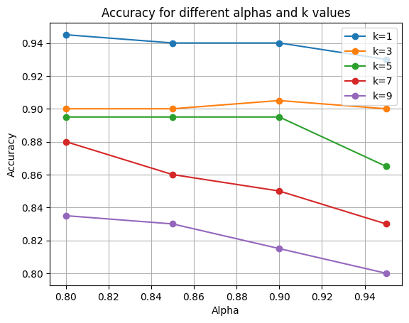

# **Face Recognition Using PCA & LDA Algorithms for Dimensionality Reduction (Eigen Faces)**

## PCA
Principal Component Analysis (PCA) is a dimensionality reduction technique that is used to extract important features from high-dimensional datasets. PCA works by identifying the principal components of the data, which are linear combinations of the original features that capture the most variation in the data

## LDA
Linear Discriminant Analysis (LDA) is a dimensionality reduction technique that is used to reduce the number of features in a dataset while maintaining the class separability. LDA is a supervised technique, meaning that it uses the class labels to perform the dimensionality reduction. LDA is a popular technique for dimensionality reduction in the field of pattern recognition and machine learning

## Dataset
- The dataset for this project is the [AT&T Face Database](https://www.kaggle.com/datasets/kasikrit/att-database-of-faces)
- The dataset is open-source and can be downloaded from Kaggle.
- The dataset contains 400 images of 40 people, each person has 10 images.
- The images are of size 92x112 pixels & in grayscale.
- The images are stored in the `datasets/faces` folder.


### Generating the Data Matrix and the Label vector

---

- The Data Matrix is 400 x 10304 where each image is flattened in a vector and saved as a row in the Matrix
- Each 10 images of a person are given the same label from [1:40]

```python
paths = ["datasets/s" + str(i) for i in range(1, 41)]
cnt = 0
Data = np.zeros((400, 10304))
labels = np.zeros((400, 1))
for i in range(40):
    labels[i * 10 : (i + 1) * 10] = i + 1
for path in paths:
    files = os.listdir(path)
    for file in files:
        img = Image.open(path + "/" + file)
        np_img = np.array(img)
        np_img = np_img.flatten()
        Data[cnt] = np_img
        cnt += 1
```

### Spliting the Dataset into Training and Test sets

---

- Keeping the odd rows (assuming row[0] is the odd) for Training and the even rows (assuming row[1] is even) for Testing

```python
X_train = Data[0::2]
X_test = Data[1::2]
y_train = labels[0::2]
y_test = labels[1::2]
```

## PCA
### pseudocode for PCA

```python
def get_PCA(X_train, alpha):
    # Compute the mean of the training data
    mean_face = np.mean(X_train, axis=0)
    # subtract the mean from the training data
    X_train_centralized = X_train - mean_face
    # compute the covariance matrix
    cov_matrix = X_train_centralized @ X_train_centralized.T
    # compute the eigenvalues and eigenvectors
    eigenvalues, eigenvectors = np.linalg.eig(cov_matrix)
    # sort the eigenvectors descindigly by eigenvalues
    idx = np.argsort(eigenvalues)[::-1]
    eigenvalues = eigenvalues[idx]
    eigenvectors = eigenvectors[:, idx]
    # restore the original eigenvectors
    eigenvectors_converted = X_train_centralized.T @ eigenvectors
    # normalize the eigenvectors_converted
    eigenfaces = eigenvectors_converted / np.linalg.norm(eigenvectors_converted, axis=0)
    # compute the number of components to keep
    sum = 0
    no_components = 0
    for i in range(len(eigenvalues)):
        sum += eigenvalues[i]
        no_components += 1
        if sum / np.sum(eigenvalues) >= alpha:
            break
    # project the training data on the eigenfaces
    return  mean_face, eigenfaces[:, :no_components]
```

**Trick to get eigen values/vectors from Cov Matrix** <br>

1. The Cov Matrix is Computed as Z.T \* Z (10304 x 10304) so getting the eigen values/vectors from this matrix requires too much time.
2. Instead we computed Cov matrix as Z \* Z.T, According to Linear Algebra the eigen values computed from this matrix is the same as the original one but takes only the first 200 (which covers over 99% of the total variance).
3. Where the original eigen vectors are restored by this formula: ui=A\*vi where ui is the original eigen vector (10304 x 1) and vi is the smaller one (200 x 1).
4. It gives the same results and in lesser time.

#### The First 5 eigen faces

---


#### Projecting The Train Data and Test Data using the Same Projection Matrix

---

```python
def PCA_Projected_data(mean_face,eigenfaces):
    X_train_centered = X_train - mean_face
    X_train_projected = X_train_centered @ eigenfaces
    X_test_centered = X_test - mean_face
    X_test_projected = X_test_centered @ eigenfaces
    return X_train_projected, X_test_projected
```

#### Using KNN with K=1 as a classifier

---

- The Classifier is trained with the projected training data using **knn.fit()**
- Then the classifier is given the projected test data and the predicted values (labels) are saved in **Y_pred**
- The y_pred is compared with the y_test to get accuracy (actual labels)

```python
def Test_PCA(alpha, k):
    mean_face, eigenfaces = get_PCA(X_train, alpha)
    X_train_pca, X_test_pca = PCA_Projected_data(mean_face, eigenfaces)
    knn = KNeighborsClassifier(k, weights="distance")
    knn.fit(X_train_pca, y_train.ravel())
    y_pred = knn.predict(X_test_pca)
    accuracy = accuracy_score(y_test, y_pred.ravel())
    return accuracy
```

#### The Accuracy for each value of alpha

---

<div>
<table border="1" class="dataframe">
  <thead>
    <tr style="text-align: right;">
      <th></th>
      <th>Accuracy</th>
    </tr>
  </thead>
  <tbody>
    <tr>
      <th>0.80</th>
      <td>0.945</td>
    </tr>
    <tr>
      <th>0.85</th>
      <td>0.94</td>
    </tr>
    <tr>
      <th>0.90</th>
      <td>0.94</td>
    </tr>
    <tr>
      <th>0.95</th>
      <td>0.93</td>
    </tr>
  </tbody>
</table>
</div>

- As alpha increases, the classification accuracy decreases due to overfitting and it is more sensitive to noises
  

## LDA

### pseudocode for LDA

```python
def get_LDA(X_train):

    # Computing the overall mean
    overall_mean = np.mean(X_train, axis=0).reshape(10304, 1)

    # Computing the between-class & within-class scatter matrix
    S_B = np.zeros((10304, 10304))
    S_W = np.zeros((10304, 10304))

    for i in range(1, 41):
        # Computing the mean of each class
        class_mean = np.mean(X_train[(i - 1) * 5 : i * 5], axis=0)

        # Reshaping the mean to be a column vector
        class_mean = class_mean.reshape(10304, 1)

        # Computing the between-class scatter matrix by summing the outer products of the difference between the class mean and the overall mean
        S_B += 5 * np.dot((class_mean - overall_mean), (class_mean - overall_mean).T)

        # Computing the centered data
        centered_data = X_train[(i - 1) * 5 : i * 5] - np.mean(
            X_train[(i - 1) * 5 : i * 5], axis=0
        )

        # Computing the within-class scatter matrix by summing the outer products of the centered data
        S_W += np.dot(centered_data.T, centered_data)

    # Computing the total projection matrix
    S = np.dot(np.linalg.inv(S_W), S_B)

    # Computing the eigenvalues and eigenvectors
    eigenvalues, eigenvectors = np.linalg.eigh(S)

    idx = eigenvalues.argsort()[::-1]
    sorted_eigenvectors = eigenvectors[:, idx]

    # Taking only the dominant eigenvectors
    projection_matrix = sorted_eigenvectors[:, :39]

    return projection_matrix
```

#### Projecting The Train Data and Test Data using the Same Projection Matrix

---

```python
def LDA_projected_data(projection_matrix):
    projected_X_train = np.dot(X_train, projection_matrix)
    projected_X_test = np.dot(X_test, projection_matrix)
    return projected_X_train, projected_X_test
```

#### Using KNN with K=1 as a classifier

---

- The Classifier is trained with the projected training data using **knn.fit()**
- Then the classifier is given the projected test data and the predicted values (labels) are saved in **Y_pred**
- The y_pred is compared with the y_test to get accuracy (actual labels)

```python
def Test_LDA(k):
    projected_X_train, projected_X_test = LDA_projected_data(LDA_projection_matrix)
    knn = KNeighborsClassifier(n_neighbors=k)
    knn.fit(projected_X_train, y_train.ravel())
    y_pred = knn.predict(projected_X_test)
    accuracy = accuracy_score(y_test, y_pred.ravel())
    return accuracy
```

- LDA Accuracy for k = 1 is **95%**

## Classifier Tunning (Hyperparameter Tuning for K in KNN)

### The tie breaking is done by choosing the least distance (weights = "distance")

- PCA
<div>
<table border="1" class="dataframe">
  <thead>
    <tr style="text-align: right;">
      <th></th>
      <th>1</th>
      <th>3</th>
      <th>5</th>
      <th>7</th>
      <th>9</th>
    </tr>
  </thead>
  <tbody>
    <tr>
      <th>0.80</th>
      <td>0.945</td>
      <td>0.9</td>
      <td>0.895</td>
      <td>0.88</td>
      <td>0.835</td>
    </tr>
    <tr>
      <th>0.85</th>
      <td>0.94</td>
      <td>0.9</td>
      <td>0.895</td>
      <td>0.86</td>
      <td>0.83</td>
    </tr>
    <tr>
      <th>0.90</th>
      <td>0.94</td>
      <td>0.905</td>
      <td>0.895</td>
      <td>0.85</td>
      <td>0.815</td>
    </tr>
    <tr>
      <th>0.95</th>
      <td>0.93</td>
      <td>0.9</td>
      <td>0.865</td>
      <td>0.83</td>
      <td>0.8</td>
    </tr>
  </tbody>
</table>
</div>

- LDA
<div>
<table border="1" class="dataframe">
  <thead>
    <tr style="text-align: right;">
      <th></th>
      <th>accuracy</th>
    </tr>
  </thead>
  <tbody>
    <tr>
      <th>1</th>
      <td>0.950</td>
    </tr>
    <tr>
      <th>3</th>
      <td>0.915</td>
    </tr>
    <tr>
      <th>5</th>
      <td>0.890</td>
    </tr>
    <tr>
      <th>7</th>
      <td>0.875</td>
    </tr>
    <tr>
      <th>9</th>
      <td>0.860</td>
    </tr>
  </tbody>
</table>
</div>

### Variations

#### PCA Variant (Kernel PCA)

- Kernel PCA is a non-linear dimensionality reduction technique that uses a kernel function to map high-dimensional data into a lower-dimensional space. This allows it to capture non-linear relationships between variables that are not possible with linear PCA.
- The time complexity of normal PCA is O(d^3), where d is the number of dimensions, while the time complexity of kernel PCA is O(n^3), where n is the number of data points. The computation of the kernel matrix is the most computationally expensive step in kernel PCA.
- Kernel PCA may be more accurate than normal PCA for datasets with non-linear relationships between variables, as it can capture these relationships. However, kernel PCA is more prone to overfitting than normal PCA, and the choice of kernel function can greatly affect the performance of kernel PCA.

#### LDA Variant (Shrinkage LDA)

- Shrinkage LDA (Linear Discriminant Analysis) is a variant of the standard LDA method that is used for classification and dimensionality reduction. The key difference between shrinkage LDA and normal LDA is that the former incorporates a regularization term that shrinks the sample covariance matrix towards a diagonal matrix.

- This regularization is particularly useful when dealing with high-dimensional data, as it helps to overcome the small sample size problem by stabilizing the covariance estimates. Shrinkage LDA has been shown to outperform traditional LDA in terms of classification accuracy, especially when the number of features is much larger than the number of observations.

- Another advantage of shrinkage LDA is that it can handle multicollinearity between the predictor variables, which can be a problem in standard LDA when the predictors are highly correlated. In summary, shrinkage LDA is a powerful tool for classification and dimensionality reduction that can improve the accuracy of LDA in high-dimensional and small sample size settings.
